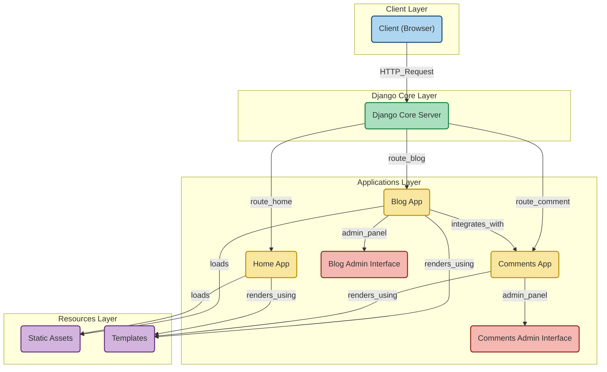

# Django博客系统

一个功能完善的个人博客系统，基于Django框架开发，集成了文章管理、评论系统、搜索和归档等核心功能。

## 项目亮点

### 文章管理
- 支持文章的创建、编辑和删除
- Markdown格式支持，实现富文本编辑
- 文章自动目录生成
- 代码块高亮显示
- 文章浏览量统计

### 分类与标签系统
- 文章分类管理
- 多标签支持
- 标签云展示

### 评论系统
- 独立的评论应用
- 支持评论表单验证
- 评论与文章关联
- 评论审核功能

### 搜索功能
- 支持全文搜索
- 模糊匹配搜索
- 搜索结果高亮显示

### 归档功能
- 文章按时间归档
- 支持按年月分类
- 归档页面展示

### 技术特点
- Django框架
- Markdown渲染
- 响应式设计
- 分页功能
- SEO优化

## 项目结构




## 快速开始

### 1. 克隆项目

```bash
git clone https://github.com/Jack-samu/djangoPra
cd djangoPra
```

### 2. 创建并激活虚拟环境

```bash
python -m venv venv
source venv/bin/activate  # Linux/Mac
# 或
venv\Scripts\activate     # Windows
```

### 3. 安装依赖包

```bash
pip install -r requirements.txt
```

### 4. 数据库迁移

```bash
python manage.py migrate
```

### 5. 创建管理员账号

```bash
python manage.py createsuperuser
```

### 6. 运行开发服务器

```bash
python manage.py runserver
```

### 7. 访问博客

打开浏览器，访问 `http://localhost:8000`，即可看到博客首页。

### 8. 管理后台

访问 `http://localhost:8000/admin`，使用管理员账号登录，即可进入管理后台。

### 9. 搜索功能

访问 `http://localhost:8000/search`，即可使用搜索功能。

### 10. 归档功能

访问 `http://localhost:8000/archive`，即可看到文章归档。

### 11. 退出虚拟环境

```bash
deactivate
```

## 项目配置

### 数据库配置

```python
DATABASES = {
    'default': {
        'ENGINE': 'django.db.backends.sqlite3',
        'NAME': BASE_DIR / 'db.sqlite3',
    }
}
```

### 管理员账号

```python
# server/server/settings.py

# 管理员账号
# username: admin
# password: 123456
```

### 项目设置

```python
# server/server/settings.py

# 项目设置
DEBUG = True
ALLOWED_HOSTS = ['*']
```

## 项目特点

### 1. 响应式设计

博客系统使用响应式设计，可以在任何设备上访问。

### 2. Markdown编辑

支持Markdown编辑，实现富文本编辑。

### 3. 代码块高亮

支持代码块高亮，实现代码块高亮显示。

### 4. 分页功能

支持分页功能，实现分页显示。

### 5. SEO优化

支持SEO优化，实现SEO优化。

## 项目依赖

- Django 4.0.1
- Markdown 3.3.6
- Faker 21.0.1
- django-markdownify 0.10.0
- django-highlightjs 0.1.0

## 项目作者

- 作者：Jack
- 邮箱：pentaJack@163.com
- GitHub：https://github.com/Jack-samu/djangoPra

## 项目许可证

MIT License

